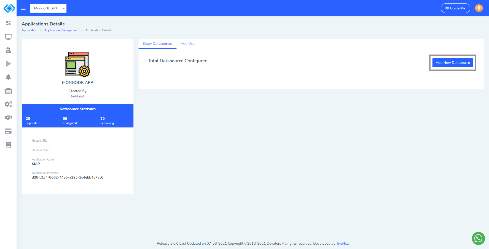

# mySuperMon-service


The *mysupermon-service* is a [Keptn](https://keptn.sh) service that is responsible for collecting datatbase statistics performed while test sequence executed using [mySuperMon](https://app.mysupermon.com) endpoints.

We are going to install the service in the same cluster that Keptn is running in.
Checkout also the [installation option for Keptn on K3s](https://github.com/keptn-sandbox/keptn-on-k3s).

## Installation

Before mySuperMon-service installation there are some prerequisite need to follow.
### Deploy mySuperMon database Agent

1. Create a mysupermon-agent.yaml file and copy below yaml content paste into it. Replace IMAGE_NAME with image name you need, you can find myspermon agent images here [mySuperMon Docker hub](https://hub.docker.com/u/mysupermon)

    **NOTE**
    1. Replace AGENT_DATABASE_NAME with the agent supported database name
    1. Replace IMAGE_NAME with image name you need (MySQL, PostgreSQL, MariaDB, MSSQL, ORACLE, MongoDB), you can find myspermon agent images here [mySuperMon Docker hub](https://hub.docker.com/u/mysupermon)
    1. Replace port no with agent supported port you can find it on it's docker hub overview tab.

    


    ```yml
    apiVersion: apps/v1
    kind: Deployment
    metadata:
        name: AGENT_DATABASE_NAME-agent
    spec:
        replicas: 1
        selector:
            matchLabels:
            app: AGENT_DATABASE_NAME-agent
        template:
            metadata:
                labels:
                app: AGENT_DATABASE_NAME-agent
            spec:
                containers:
                - name: AGENT_DATABASE_NAME-agent
                image: mysupermon/IMAGE_NAME:latest
                ports:
                - containerPort: 8111  
    ```

1. Apply the mysupermon-agent.yaml file using below command in the in the same cluster that Keptn is running in.

    ```console
    kubectl apply -f mysupermon-agent.yaml -n keptn
    ```

1. After deploying the agent check the logs of agent using below command and copy Agent unique id

    ```console
    kubectl logs -f deployment/AGENT_DEPLOYMENT_NAME -n keptn
    ```

    ```console
    ################################################################
    ########## Agent Unique Id : 9604729ADE98MONGO-AGENT-DEPLOY-XXXXXXXXXX-9D882190-MONGODB ################
    ################################################################

    ```


### Add Agent, Application Name and Database

1. Visit to [mySuperMon](https://app.mysupermon.com) and log in.

1. Click on *Agent -> Agent Management* in the side menu and fill the form. Paste the Agent Unique Id (9604729ADE98MONGO-AGENT-DEPLOY-XXXXXXXXXX-9D882190-MONGODB) in the *Agent Unique Id* field.


1. Click on *save* to add agent.

1. Click on *Application -> Application Management* and click on the *New Application* Button on the page.


1. Fill the form and click on *save* to add application.


1. Now click on the added application and then click on *Add New Datasource* button to add database.




1. Fill the form by selecting driver type , Agent, Enter Database username, Database password, Host url of Database, Port no. on whitch database is running, database name and email.


```console
# You can find Host Url using this command
kubectl get pods -o wide -n sockshop-dev

NAME                        READY   STATUS    RESTARTS   AGE    IP                        NODE                  NOMINATED NODE   READINESS GATES
carts-db-54b449c598-kxggb   1/1     Running   0          62d    10.42.1.20 <== Host Url   k3d-mykeptn-agent-0   <none>           <none>
carts-76b56b96dd-g9djp      1/1     Running   0          3h6m   10.42.1.54                k3d-mykeptn-agent-0   <none>           <none>

```

1. Click on Test Connection after successful connection Click on save connection.


Now we will deploy the mySuperMon Service in the Keptn Cluster.

### Deploy mySuperMon Service

1. Create a secret using mySuperMon username and password, you can go ahead and copy/paste this next line. Make sure you are connected to the correct Kubernetes cluster.

    ```console
    kubectl create secret generic mysupermon --from-literal="mysupermon_username=YOUR_MYSUPERMON_USERNAME" --from-literal="mysupermon_password=YOUR_MYSUPERMON_PASSWORD" -n keptn
    ```

1. Now clone the mysupermon service repo

    ```console
    git clone https://github.com/keptn-sandbox/mySuperMon-service.git
    ```

2. Apply [`deploy/service.yaml`](deploy/service.yaml) file.

    ```console
    kubectl apply -f service.yaml -n keptn
    ```

3. Verify mysupermon service is running and user authenticated.

    ```console
    kubectl -n keptn logs -f deployment/mysupermon-service -c mysupermon-service


    Subscribing to deployment.triggered
    Subscribing to test.triggered
    Found environment variables KEPTN_ENDPOINT and KEPTN_API_TOKEN, polling events from API
    Found enviroment variables MYSUPERMON_USERNAME, MYSUPERMON_PASSWORD, MYSUPERMON_ENDPOINT
    INFO --> Mysupermon authentication successful.
    Starting to poll...
    Exit using CTRL-C

    ```

### Enable prometheus monitoring

To enable the prometheus monitoring with mysupermon service we need to add scrape jobs to prometheus configmap.
But before that we need to setup the prometheus monitoring for that follow this document [`Setup Prometheus Monitoring`](https://tutorials.keptn.sh/tutorials/keptn-full-tour-prometheus-09/index.html?index=..%2F..index#12).

1. Edit prometheus configmap using following command.
   ```console
   kubectl edit configmap prometheus-server -n monitoring
   ```
   
2. Add following scrape job to the configmap `scrape_configs:`.
   ```yml
   ...
   job_name: mysupermon-service
   honor_timestamps: false
   scrape_interval: 10s
   scrape_timeout: 10s
   metrics_path: /metrics
   scheme: http 
   static_configs:
   - targets:
           - mysupermon-service.keptn.svc:8080
   ...
   ```
3. To verify that the mySuperMon-service scrape jobs are correctly set up, you can access Prometheus by enabling port-forwarding for the prometheus-service:
   
   ```console
   kubectl port-forward svc/prometheus-server 8080:80 -n monitoring
   ```
   Prometheus is then available on [`localhost:8080/targets`](http://localhost:8080/targets) where you can see the targets for the service:

   

### Usage

The mySuperMon-service expects mysupermon application identifier file in the project specific keptn repo.

`NOTE:` It is mandatory to provide  [`mysupermon_app_identifier.txt`](test_resources/mysupermon_app_identifier.txt) before triggering delivery.

Here is an example on how to upload the [`mysupermon_app_identifier.txt`](test_resources/mysupermon_app_identifier.txt) file via keptn CLI to the project sockshop:

```console
keptn add-resource --project=sockshop --resource=mysupermon_app_identifier.txt
```

For executing performance or functional test use [locust-service](https://github.com/keptn-sandbox/locust-service)  or any other service so mySuperMon can collect database statistics.

Now trigger a delivery for carts service.

```console
keptn trigger delivery --project=sockshop --service=carts --image=docker.io/keptnexamples/carts --tag=0.12.3
```


### Common tasks

* Deploy the service using `kubectl`: `kubectl apply -f deploy/service.yaml`
* Delete/undeploy the service using `kubectl`: `kubectl delete -f deploy/service.yaml`
* Watch the deployment using `kubectl`: `kubectl -n keptn get deployment mysupermon-service -o wide`
* Get logs using `kubectl`: `kubectl -n keptn logs deployment/mysupermon-service -f mysupermon-service`
* Watch the deployed pods using `kubectl`: `kubectl -n keptn get pods -l run=mysupermon-service`

## Uninstall - Delete from your Kubernetes cluster

To delete the mySuperMon-service, delete using the [`deploy/service.yaml`](deploy/service.yaml) file:

```console
kubectl delete -f deploy/service.yaml
```
## License

Please find more information in the [LICENSE](LICENSE) file.
